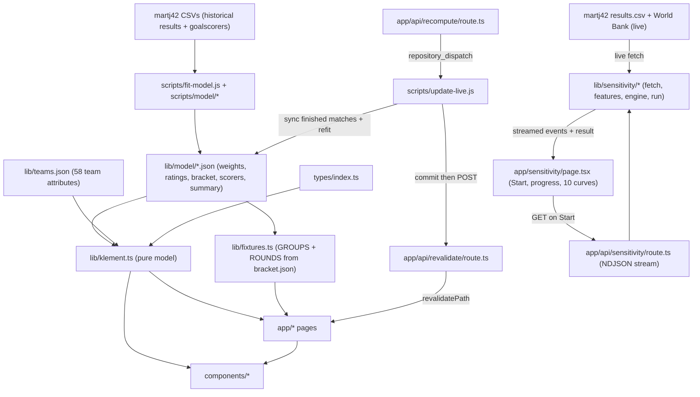

# Architecture

## Overview

WC26 Klement is a static, client-simulated FIFA World Cup 2026 forecast site
whose model is fit from real match data. It is a Next.js App Router application
with no database and no app-owned backend. Forecasts are computed from pure
functions over committed JSON artifacts; every random simulation runs in the
visitor's browser.

The model artifacts in `lib/model/` (weights, Elo ratings, bracket, scorers, fit
summary) are produced offline by `scripts/fit-model.js` from open historical
international results: factor weights are fit by logistic regression, an Elo
rating is built point-in-time from every result, a Poisson model gives
scorelines, and per-player goal rates give a topscorer projection. The bracket
is generated from the model and the real group draw, not hand-authored.

Three server routes exist: `POST /api/revalidate` (ISR webhook),
`POST /api/recompute` (dispatches the refit Action), and `GET /api/sensitivity`
(an NDJSON-streaming weight-sensitivity explorer that fetches live data and runs
on demand; it is explorer-only and does not touch the production model). The
background process is a GitHub Actions job that polls API-Football for finished
matches, refits the model after each one, commits the artifacts, and triggers
revalidation.

## Modules

| Module | Responsibility | Docs |
|---|---|---|
| `lib` | Pure forecast model reading `lib/model/*.json`, generated fixtures, flag mapping, live-data clients | [lib/Documentation.md](lib/Documentation.md) |
| `lib/model` | Committed fitted artifacts: weights, ratings, bracket, scorers, fit-summary, live results | (see lib/Documentation.md) |
| `lib/sensitivity` | Live weight-sensitivity explorer engine: fetch sources, build point-in-time features, fit baseline, sweep each coefficient; streamed by `/api/sensitivity` | [lib/sensitivity/Documentation.md](lib/sensitivity/Documentation.md) |
| `app` | Next.js App Router pages, root layout, ISR revalidate and recompute API routes | [app/Documentation.md](app/Documentation.md) |
| `components` | React UI components grouped by domain (ui, match, team, landing, knockout) | [components/Documentation.md](components/Documentation.md) |
| `types` | Shared TypeScript interfaces (`WDL`, `ScorePrediction`, `ScorerProjection`, etc.) | [types/Documentation.md](types/Documentation.md) |
| `scripts` | Node model-fitting pipeline (`fit-model.js`, `update-live.js`, `model/*`), run locally and by CI | [scripts/Documentation.md](scripts/Documentation.md) |
| `tests` | Vitest unit tests for the model functions | [tests/Documentation.md](tests/Documentation.md) |

Non-module folders: `public` holds static image assets, `.github/workflows`
holds CI definitions. Neither contains application source, so neither carries a
`Documentation.md`.

## System Diagram

The `/api/sensitivity` subgraph is intentionally disconnected from the
production model: the explorer fits its own throwaway weights from a live fetch
and never writes `lib/model/`.

Data flow split:
- Group standings (`/groups`) render deterministic expected standings from
  `matchP`; a button runs a random round-robin via `simResult` + `calcStandings`
  client-side (ADR-013).
- Knockout pages are statically generated from `ROUNDS` (model-generated bracket)
  plus `matchP`; the per-match pick is the model's higher-probability side.
- Monte Carlo (`/mc`), the match predictor (`/versus`), and the score predictor
  (`/score`) run all randomness and scoreline math in the browser.

## Technology Stack

| Layer | Technology | Version constraint |
|---|---|---|
| Framework | Next.js (App Router) | `16.2.6` (defined in package.json:14) |
| UI runtime | React, React DOM | `19.2.4` (defined in package.json:15-16) |
| Language | TypeScript | `^5` (defined in package.json:26) |
| Styling | Tailwind CSS v4 via PostCSS plugin | `^4` (defined in package.json:19, 25) |
| Icons | lucide-react | `^1.17.0` (defined in package.json:13) |
| Fonts | `Press_Start_2P` via `next/font/google`, exposed as `--font-pixel` | defined in app/layout.tsx:6-10 |
| Test runner | Vitest | `^4.1.7` (defined in package.json:27) |
| Lint | ESLint + eslint-config-next (flat config) | `^9` / `16.2.6` (defined in package.json:23-24) |
| CI runtime | Node.js | `20` (defined in .github/workflows/ci.yml:17) |
| Model | Pure TypeScript, no external math library | `lib/klement.ts` |
| Data | Static JSON frozen at Klement's April 2026 values | `lib/teams.json` |

The UI is a pixel/retro design (`Press_Start_2P`, `px-border` / `px-shadow`
utility classes, `PixelParticles`). Color tokens live in the `@theme` block of
`app/globals.css`. The README's "Trionda Light glass" and Framer Motion
descriptions are stale; there is no Framer Motion dependency in
package.json.

## Entry Points

| Entry point | Kind | Location |
|---|---|---|
| `/` | Static page (landing) | app/page.tsx |
| `/about` | Static page (model explainer) | app/about/page.tsx |
| `/groups` | Static page (12 group cards) | app/groups/page.tsx |
| `/versus` | Client page (match predictor) | app/versus/page.tsx |
| `/score` | Client page (Poisson scoreline predictor) | app/score/page.tsx |
| `/topscorers` | Static page (Golden Boot projection) | app/topscorers/page.tsx |
| `/lookup` | Server redirect to `/versus` | app/lookup/page.tsx |
| `/teams` | Client page (team profiles + ranking) | app/teams/page.tsx |
| `/mc` | Client page (Monte Carlo) | app/mc/page.tsx |
| `/sensitivity` | Client page (live weight-sensitivity explorer) | app/sensitivity/page.tsx |
| `/knockout/[round]` | Statically generated round page | app/knockout/[round]/page.tsx |
| `/knockout/[round]/[match]` | Statically generated match page | app/knockout/[round]/[match]/page.tsx |
| `/knockout/bracket` | Static bracket page | app/knockout/bracket/page.tsx |
| `POST /api/revalidate` | ISR revalidation webhook | app/api/revalidate/route.ts |
| `POST /api/recompute` | Webhook that dispatches the refit GitHub Action | app/api/recompute/route.ts |
| `GET /api/sensitivity` | NDJSON-streaming explorer endpoint (`runtime='nodejs'`, `maxDuration=60`, `Cache-Control: no-store`); delegates to `lib/sensitivity/run.ts` | app/api/sensitivity/route.ts |
| `scripts/fit-model.js` | Node fitting pipeline; `npm run fit` and CI | scripts/fit-model.js |
| `scripts/update-live.js` | Sync finished matches then refit; `npm run update:live` and CI | scripts/update-live.js |
| `run.bat` | Windows launcher: installs deps if needed, runs `npm run dev`, opens the browser | ../run.bat |

The knockout routes export `generateStaticParams`, so every round and match is
pre-rendered at build time.

## Cross-Cutting Concerns

- **Model purity.** All forecast math lives in `lib/klement.ts` and has no I/O
  and no side effects. Any component that calls `simResult` / `simKO`
  (randomness) is a client component (`'use client'`).
- **Single source of team data.** `lib/teams.json` is the only place team
  attribute values live. Nothing inlines them.
- **Static-first rendering.** Pages are static or statically generated. State
  and randomness are confined to the client pages `/versus`, `/teams`, `/mc`
  and the client component `GroupCard`.
- **Authorisation.** The single API route is guarded by a shared-secret query
  parameter compared against `REVALIDATE_TOKEN`.
- **Light mode only.** There is no dark theme.
- **Logging.** This project emits no per-router log files; it is a static
  site with stateless webhooks and no app-owned backend, so the endpoint
  logging standard's file loggers do not apply. The `/api/sensitivity` route
  uses `console` logging (stage start, completion, errors), captured by Vercel.

## External Integrations

| Integration | Purpose | Connection | Status |
|---|---|---|---|
| martj42/international_results | Historical results + goalscorers; the model's training data and the explorer's live source | `scripts/model/dataset.js` GETs raw CSVs offline; `lib/sensitivity/sources.ts` GETs `results.csv` at runtime; no key | Active (offline fit + live explorer) |
| World Bank | GDP per capita and population for the explorer's `gdp`/`pop` features | `lib/sensitivity/sources.ts` GETs `country/all/indicator/{NY.GDP.PCAP.CD,SP.POP.TOTL}` at runtime; no key | Active (live explorer) |
| API-Football | Finished WC matches and live topscorers | `scripts/model/live.js` and `lib/api-football.ts`, gated on `API_FOOTBALL_KEY` | Active when key set |
| flagcdn.com | Country flag images | `flagUrl` builds `https://flagcdn.com/{w}x{h}/{code}.png`; allowed in next.config.ts:8 | Active |
| Polymarket | Outbound link to World Cup markets | `lib/polymarket.ts` returns a static URL; rendered by `PolymarketBtn` | Link only |
| x.com / GitHub | Social links | Anchor tags in `components/ui/Nav.tsx` | Link only |

## Deployment

- **Host:** Vercel (per README). The app builds with `npm run build` and serves
  static and statically generated pages plus one ISR webhook.
- **CI gate:** `.github/workflows/ci.yml` runs two jobs on Node 20 - `npm test`
  (Vitest) and `npm run build` - on push to `main`, `master`, `dev`, `staging`
  and on pull requests to `main`, `master`, `dev`.
- **Model refit:** `.github/workflows/update-model.yml` runs on a poll schedule,
  on `repository_dispatch` (`match-finished`), and on manual `workflow_dispatch`.
  It runs `scripts/update-live.js` (sync finished matches via
  `API_FOOTBALL_KEY`, then refit), commits `lib/model/` if it changed, then
  POSTs to `${NEXT_PUBLIC_APP_URL}/api/revalidate?secret=${REVALIDATE_TOKEN}`.
- **Configuration:** `API_FOOTBALL_KEY`, `REVALIDATE_TOKEN`,
  `NEXT_PUBLIC_APP_URL`, and optional `GH_DISPATCH_TOKEN` / `GH_REPO` are set as
  GitHub Actions secrets and (optionally) in `.env.local`. All are optional for
  local development; the model still fits from the historical dataset without a
  key, and revalidation is skipped when unset.
