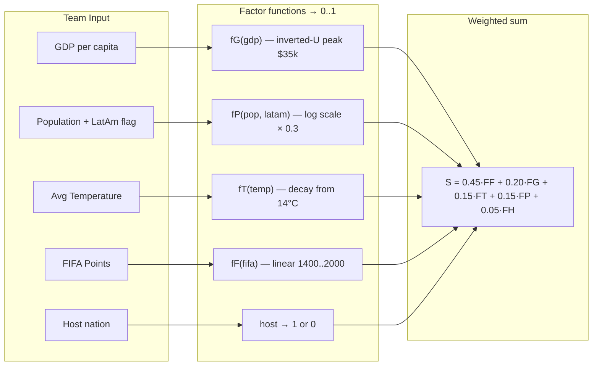
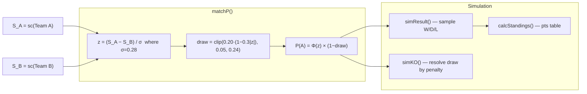

<div align="center">


# WC26 Klement


**A self-fitting World Cup forecast: model weights are re-fit from real match results and refresh after every game.**

[](https://x.com/klementworldcup)


</div>

WC26 Klement started as a surface for Joachim Klement's econometric World Cup forecast and is now a data-driven predictor whose weights are fit from history. It learns the factor weights by logistic regression over tens of thousands of real international results, layers an Elo rating built point-by-point from those results, predicts scorelines with a Poisson goals model, and projects the Golden Boot from real per-player international scoring. The whole model refits after each finished World Cup match.

---

## What it does

- **Match Lookup (Versus)** — Select any two teams for win/draw/loss probabilities plus side-by-side factor breakdowns
- **Score Prediction** — Poisson goals model gives the most-likely scoreline, a full scoreline heatmap, expected goals, BTTS and over/under 2.5
- **Topscorers (Golden Boot)** — Projected tournament goals per player from real recent international scoring, weighted by the team's expected run; live leaders when an API key is set
- **Team Profiles** — Each team's Elo rating, 0-100 strength index, FIFA points, GDP, and the fitted factor breakdown; head-to-head vs top opponents
- **Group Stage** — Deterministic expected standings per group, with a one-click random simulation
- **Knockout Bracket** — A model-generated bracket from R32 to the Final, derived from the real group draw
- **Monte Carlo** — Run full-tournament simulations in the browser; champion distribution sorted by frequency
- **Model Explainer (About)** — The self-determined weights, the proof (accuracy, log-loss, Brier, calibration), and top Elo ratings
- **Sensitivity Explorer (Sweep)** — A live, point-in-time out-of-sample experiment: fetch the real sources, fit weights on World Cups up to 2014, then sweep each of 10 candidate features one at a time and chart how training and out-of-sample (2018/2022/2026) log-loss respond; streamed over NDJSON. Explorer-only, it does not change the production model
- **Event-driven refit** — A GitHub Action pulls finished match results from API-Football, refits the model, commits the new weights, and triggers ISR revalidation

---

## Key features

| Feature | Description |
|---|---|
| Data-driven model | Weights fit from results; W/D/L, scorelines (Poisson), and topscorers. Metrics shown on About. |
| 48 participants, 58-nation pool | The 12 groups hold the 48 participants; `teams.json` keeps a wider nation pool for any-vs-any lookups |
| Pure model functions | `sc`, `matchP`, `predictScore`, `simResult`, `simKO`, `calcStandings` read committed JSON; no API calls |
| Client-side simulation | All randomness runs in the browser. No data sent to any server. |
| Event-driven refit | GitHub Actions polls API-Football, refits the model after each finished match, commits, and revalidates |
| Trionda Light design | Color system inspired by the Adidas Trionda FIFA WC 2026 ball |
| Glass aesthetic | Subtle `backdrop-filter` glass cards + color panel strips (blue/red/green) |
| Plus Jakarta Sans | Geometric sans heading font paired with Inter for body copy |

---

## The model

```
S       = sum( beta_k * standardized_factor_k )   factors: gdp, pop, temp, fifa, elo, host
P(A win) = sigmoid(S_A - S_B) * (1 - draw)
draw     = clip(draw_max * exp(-decay * |S_A - S_B|), 0.05, 0.34)
goals    ~ Poisson( exp(mu +/- gamma * (S_A - S_B)) )
```

The `beta_k` weights are fit by logistic regression over real international results. Elo is a point-in-time rating built from every result (no lookahead). The fitted weights, the data range, and the fit metrics are written to `lib/model/` by the fitting pipeline and shown on the About page. Every artifact regenerates on each refit, so the model and the site stay in sync.

The current fit puts FIFA ranking and Elo form well ahead of the socio-economic factors the model started with, and the calibration table on About shows predicted vs observed home-win rate tracking closely.

---

## Model pipeline

### 1 — Scoring (sc function)



### 2 — Match probability and simulation (matchP / simResult / simKO)



---

## Tech stack

| Layer | Technology |
|---|---|
| Framework | Next.js (App Router, TypeScript) |
| Styling | Tailwind CSS v4 — `@theme {}` tokens in CSS |
| Fonts | Plus Jakarta Sans (headings) via `next/font/google` · System font stack for body (SF Pro / Segoe UI) |
| Animations | Framer Motion — page transitions + `whileInView` scroll reveals |
| Model | Pure TypeScript in `lib/klement.ts` — no external math libraries |
| Data | `lib/teams.json` — static, frozen at Klement's April 2026 values |
| Rankings update | GitHub Actions cron → Node.js script → ISR revalidation |
| Deploy | Vercel |

---

## Setup

```bash
# 1. Clone
git clone https://github.com/x-cookie/kalsh-main.git
cd kalsh-main

# 2. Install dependencies
npm install

# 3. Configure environment (optional — only needed for ISR revalidation)
cp .env.local.example .env.local
# Fill in REVALIDATE_TOKEN and NEXT_PUBLIC_APP_URL

# 4. Start development server
npm run dev
# -> http://localhost:3000
```

| Variable | Required | Description |
|---|---|---|
| `API_FOOTBALL_KEY` | No | API-Football key. Enables the event-driven refit on finished WC matches and live topscorer standings. Without it, the model still fits fully from the historical dataset. |
| `REVALIDATE_TOKEN` | No | Secret for `/api/revalidate` and `/api/recompute` (used by GitHub Actions) |
| `NEXT_PUBLIC_APP_URL` | No | Production URL for on-demand ISR trigger |
| `GH_DISPATCH_TOKEN` / `GH_REPO` | No | Optional. Let `/api/recompute` dispatch the refit GitHub Action from an external webhook. |

Run the fitting pipeline locally:

```bash
npm run fit          # download results, fit weights/Elo/Poisson/scorers, write lib/model/*.json
npm run update:live  # sync finished WC matches (needs key) then refit
npm run backtest     # walk-forward WC backtest 1994-2026 (pooled out-of-sample): fitted vs equal vs Elo-only
```

---

## Project structure

```
klement-model/
├── app/
│   ├── layout.tsx               ← Root layout, Plus Jakarta Sans + Inter, Nav
│   ├── page.tsx                 ← Landing page — 6 marketing sections
│   ├── globals.css              ← Trionda Light tokens, glass-card, animations
│   ├── lookup/page.tsx          ← Match predictor (team pair → WDL + factors)
│   ├── teams/page.tsx           ← Team profile (hero card + factor bars + H2H)
│   ├── mc/page.tsx              ← Monte Carlo simulator
│   ├── groups/page.tsx          ← 12 group-stage cards with simulated standings
│   ├── knockout/[round]/        ← r32 | r16 | qf | sf | final
│   ├── about/page.tsx           ← Model explainer, formula, references
│   ├── sensitivity/page.tsx     ← Sensitivity explorer (Start → live sweep → 10 curves)
│   ├── api/sensitivity/route.ts ← Live NDJSON sweep stream (fetch sources, fit, sweep)
│   └── api/revalidate/route.ts  ← ISR revalidation endpoint
│
├── components/
│   ├── ui/
│   │   ├── Nav.tsx              ← Sticky nav with active-route highlighting
│   │   ├── WDLBar.tsx           ← Win/Draw/Loss probability bar
│   │   ├── Tag.tsx              ← Pill label (blue / red / green / gray)
│   │   ├── Btn.tsx              ← Button/link (primary | green | default | ghost)
│   │   ├── HeroBanner.tsx       ← CSS conic-gradient Trionda ball graphic
│   │   ├── PageTransition.tsx   ← Framer Motion page wrapper
│   │   └── SectionLabel.tsx     ← Uppercase section header
│   ├── match/
│   │   ├── MatchCard.tsx        ← Knockout match card with Klement pick badge
│   │   ├── GroupMatchRow.tsx    ← Inline group match row
│   │   └── GroupCard.tsx        ← Group standings + collapsible match rows
│   ├── team/
│   │   ├── TeamHeroCard.tsx     ← Flag, model score, FIFA pts, GDP
│   │   ├── FactorBreakdown.tsx  ← 5-factor weighted bar chart
│   │   └── H2HList.tsx          ← Head-to-head vs top 6 opponents
│   ├── landing/
│   │   ├── HeroSection.tsx      ← Above-the-fold, CTA, trust bar
│   │   ├── TrackRecordSection.tsx ← 2014/2018/2022 prediction cards
│   │   ├── HowItWorksSection.tsx  ← 5 factor rows
│   │   ├── LivePreviewSection.tsx ← Interactive mini-predictor
│   │   ├── KlementCallSection.tsx ← Netherlands prediction + upset callout
│   │   └── FooterCTA.tsx          ← Final conversion CTA
│   └── sensitivity/
│       ├── SensitivityChart.tsx ← Inline-SVG train-vs-OOS curve per feature
│       └── ProgressTrace.tsx    ← Staged + per-feature progress UI
│
├── lib/
│   ├── klement.ts               ← Pure model: sc, matchP, simResult, simKO, calcStandings
│   ├── teams.json               ← 48 teams — frozen at Klement's April 2026 values
│   ├── fixtures.ts              ← GROUPS (12×4) + ROUNDS (r32→final) + Klement picks
│   └── sensitivity/             ← Explorer: types, sources, features, engine, run (live fetch + sweep)
│
├── types/index.ts               ← TeamData, WDL, MatchResult, SimResult, Standing
├── scripts/fetch-rankings.js    ← FIFA API → teams.json patcher (run by CI)
└── .github/workflows/
    └── update-rankings.yml      ← Weekly Thursday cron
```

---

## Design rules

1. **Score prediction is a first-class feature.** Poisson goals model on the `/score` page. (This reverses the original "W/D/L only" rule.)
2. **Weights are data-driven, not hardcoded.** `scripts/fit-model.js` fits them from results into `lib/model/weights.json`. (This reverses the original "frozen weights" rule.)
3. **No dark mode.** Light only.
4. **`teams.json` holds team attributes; `lib/model/*.json` holds the fitted model.** Never inline either; both are single sources of truth.
5. **The bracket is generated from the model**, written to `lib/model/bracket.json`, never hand-authored.
6. **`lib/klement.ts` stays pure.** It reads the committed JSON artifacts; it never makes API calls. Live fetching lives in `scripts/` and `lib/api-football.ts`.
7. **Randomness is client-side only.** `'use client'` on any component calling `simResult`/`simKO`. Server-rendered tables use deterministic expected values to avoid hydration mismatch.

---

## Attribution

- **Klement, J. (2026).** *FIFA World Cup 2026 Predictions.* Panmure Liberum Research, 9 April 2026.
- **Hoffmann, R., Ging, L.C. & Ramasamy, B. (2002).** The socioeconomic determinants of international soccer performance. *Journal of Applied Economics*, 5(2), 253–272.
- Design system inspired by the Adidas Trionda — official match ball of FIFA World Cup 2026.

This project is an independent fan tool and is not affiliated with or endorsed by Panmure Liberum, FIFA, or Adidas.

## License

MIT
