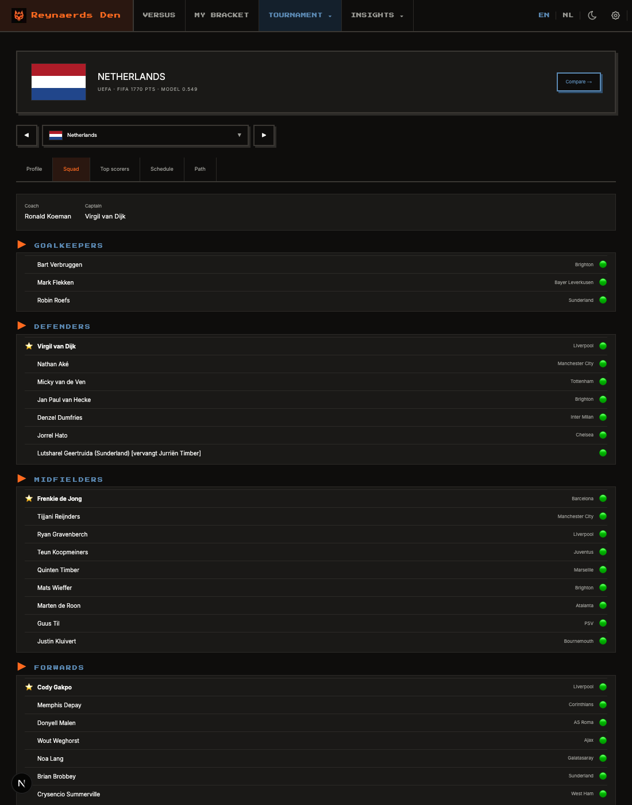
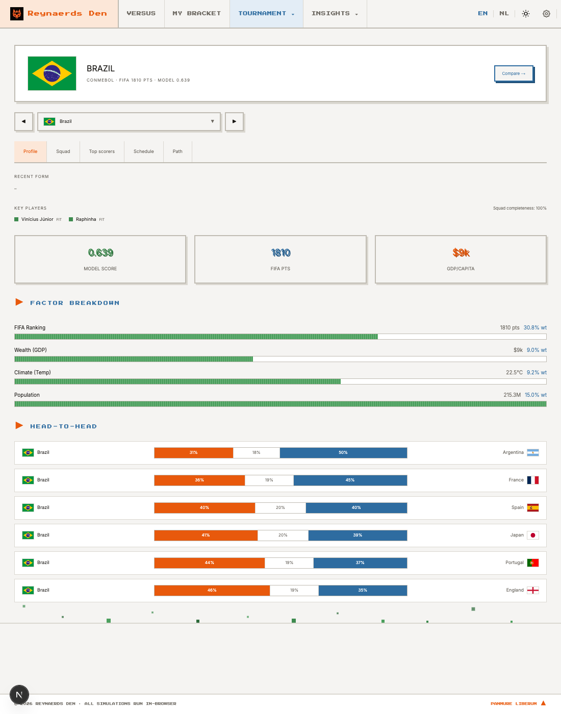

# Verification — team switcher + unified profile tab (`/teams/[team]`)

Commit verified: `49f1864` (`feat(teams): switcher + unified profile tab on detail page`).

**Verdict: PASS** — driven in a real browser (Playwright + system Chrome) against the
dev server on `:3000`, both dark and light mode.

## What was checked

- Switcher row (◀ prev / searchable dropdown / ▶ next) renders between the team
  header and the tab bar.
- Prev/next arrows navigate to the correct alphabetical neighbours and **preserve the
  active `?tab=`**:
  - `netherlands?tab=squad` → next `new-zealand?tab=squad`, prev `morocco?tab=squad`.
  - Round-trip Next → Prev returns to `netherlands?tab=squad`, tab still **Squad**.
- Dropdown search ("brazil") navigates to `brazil?tab=squad`, tab preserved.
- Tab preservation also holds for a non-default tab: on `?tab=scorers`, Next keeps
  `tab=scorers` (active tab **Top scorers**).
- Neighbour logic correct from other starting points (`argentina` prev → `algeria`,
  since Algeria sorts before Argentina).
- New **Profile** tab renders the shared `components/team/ProfileTab.tsx` content
  (recent form, key players, model/FIFA/GDP score-cards, factor breakdown, H2H).
- Renders correctly in dark and light mode (token-based; borders + text legible in both).

## Evidence

## Notes

- SSG intact: `generateStaticParams` unchanged; `npm run build` prerenders all team pages.
- `FormBar` empty state (a `–`) for teams without cached recent-form data is pre-existing,
  unrelated to this change.
